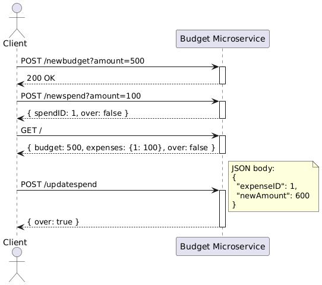

# BudgetAlertMicroservice

This microservice allows clients to manage a budget and track expenses. It supports setting a budget, adding and updating expenses, and checking if spending exceeds the budget.

## Communication Contract

### How to request from API

Use the following HTTP endpoints to interact with the service.

### Set Budget

**Endpoint**: `POST /newbudget`  
**Query Parameter**: `amount` (number)  
**Example**:

```http
POST http://localhost:54253/newbudget?amount=500
```

### Add a new expense

**Endpoint**: `POST /newbudget`  
**Query Parameter**: `amount` (number)  
**Example**:

```http
POST http://localhost:54253/newspend?amount=25.5
```

example response:
{
  "spendID": 3,
  "budgetState": false
}

### Update an expense

**Endpoint**: `POST /updatespend`  
**JSON properties**: `expenseID` id of expense to update, `newAmount` new amount of expense 
**Example**:

curl -X POST http://localhost:54253/updatespend \
  -H "Content-Type: application/json" \
  -d '{"expenseID": 1, "newAmount": 30}'

  
  example response:
  {
  "over": true
}


### Get Current Budget and expenses

Returns current budget, all expenses, and budget status (over or not).

curl http://localhost:54253/

**Example Response**:
{
  "budget": 500,
  "expenses": {
    "1": 25.5,
    "2": 50
  },
  "over": false
}

